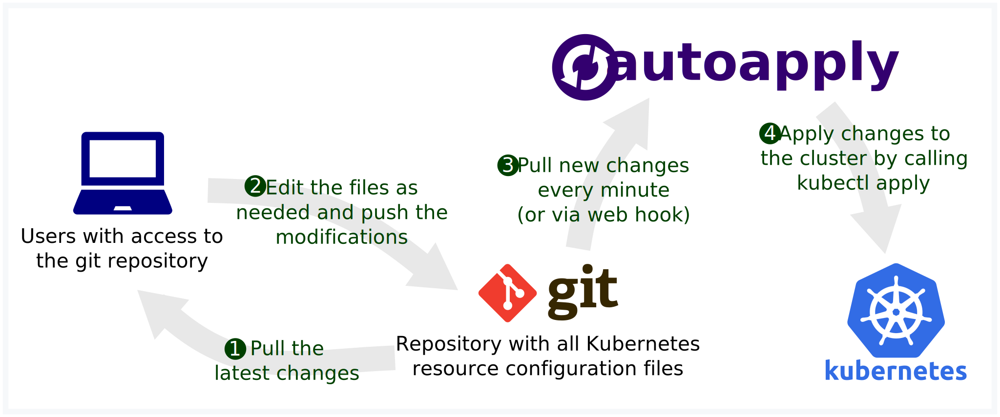

# autoapply

[](https://travis-ci.org/pascalgn/autoapply) [](https://coveralls.io/github/pascalgn/autoapply) [](https://hub.docker.com/r/pascalgn/autoapply/) [](https://github.com/pascalgn/autoapply/blob/master/LICENSE)

Automatically apply changes to a Kubernetes cluster.



- All resource files are stored in Git, which means there is a single source of truth
  for the state of your application.
- When editing resource files, the changes can be documented and merged using your standard Git workflow.
- You can use [sops](https://github.com/mozilla/sops) to store Kubernetes secrets directly in the repository.

---

1. [Usage](#usage)
2. [Configuration](#configuration)
3. [Docker tags](#docker-tags)
4. [Related projects](#related-projects)
5. [License](#license)

## Usage

First create an empty, publicly accessible repository.
For private repositories, you can use [deploy keys](docs/deploy-keys.md).
Add the desired Kubernetes resource files to the repository, for example [nginx.yaml](docs/examples/nginx.yaml),
and make sure all files have been pushed.

Now download [kubernetes-simple.yaml](docs/examples/kubernetes-simple.yaml) and change 
`https://github.com/pascalgn/hello-world` to the URL of the repository you just created.
Then create the autoapply deployment in your cluster:

```
$ kubectl apply -f kubernetes-simple.yaml
```

Now, autoapply will download the resource files from your repository and apply them to the cluster.
When you update the repository, autoapply will fetch the new files and update the cluster accordingly.

For more detailed instructions, see [Hello, World!](docs/hello-world.md)

## Configuration

A basic configuration file looks like this:

```yaml
loop:
  commands:
  - git clone --depth 1 https://github.com/pascalgn/hello-world workspace/
  - kubectl apply -f workspace/
```

For more information, see the [documentation](docs/configuration.md).

## Docker tags

* `latest` provides a minimal image with just *autoapply* installed ([Dockerfile](build/Dockerfile))
* `kubectl` also provides *git*, *kubectl*, *[sops](https://github.com/mozilla/sops)* and *[dockerize](https://github.com/jwilder/dockerize)* ([Dockerfile](build/kubectl/Dockerfile))
* `helm` also provides *git*, *[sops](https://github.com/mozilla/sops)* and *[helm](https://github.com/kubernetes/helm)* ([Dockerfile](build/helm/Dockerfile))
* `jekyll` also provides *ruby*, *java*, *git* and *[jekyll](https://jekyllrb.com)* ([Dockerfile](build/jekyll/Dockerfile))

## Related projects

- [kube-applier](https://github.com/box/kube-applier) is very similar, but less flexible.
  It doesn't support Helm or custom workflows like using sops.
- [Keel](https://github.com/keel-hq/keel) provides fully automated updates, but only changes
  the container image version, nothing else.
- [Helm](https://github.com/kubernetes/helm) does not provide automated updates, but still offers
  a consistent way to release new versions. However, you will still need a way to manage the values
  that will be used to create releases from charts.
- There is a blog post by Weaveworks about
  [GitOps and Kubernetes](https://www.weave.works/blog/gitops-high-velocity-cicd-for-kubernetes),
  which gives a good overview of the topic.

## License

Autoapply is licensed under the [MIT License](LICENSE)
